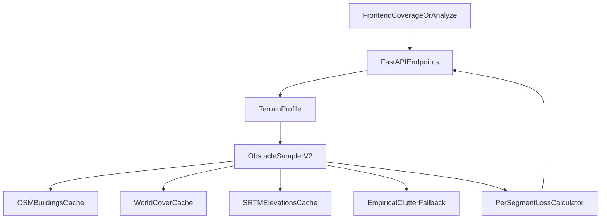

# Obstacle Model V2 — External-Data Buildings & Land Cover

> Status: **DESIGN — not yet implemented**.
> Owner: RF/Topology hardening track.
> Companion plan: `.cursor/plans/rf_+_topology_hardening_roadmap_52f80b16.plan.md`.

## 1. Goals

- Replace the empirical clutter approximation in
  `backend/services/clutter.py` with **per-pixel, per-path** obstacle data
  derived from open external sources.
- Apply the *same* obstacle data to **both**
  - point-to-point link analysis (`/api/links/analyze`)
  - radial-sweep coverage maps (`/api/simulate/coverage`, `terrain` and
    `itm` modes)
  so coverage and link-budget answers stay consistent.
- Keep current empirical clutter as a **shipping fallback** when the
  external data is unavailable (offline, no tiles cached, area outside
  coverage of source).

## 2. Non-goals

- 3-D building rendering on the map.
- Real-time updates from satellite imagery.
- Modeling indoor propagation.

## 3. Data sources (open / no-key)

### 3a. Buildings — OpenStreetMap (Overpass API)

- Query: `way["building"]` and `relation["building"]` within an AOI.
- Per-feature attributes we care about:
  - `building:levels` → height proxy (`levels * 3.0 m` if no explicit
    height).
  - `height` (when present) → meters above ground.
  - `building:material` → optional dielectric hint
    (concrete vs. wood vs. steel) for advanced modeling.
- Cache strategy: pre-tile by bounding box per
  `floor(lat) × floor(lon)` 1° tile and store as
  newline-delimited GeoJSON (`*.ndjson`) on disk under
  `srtm_cache/buildings/`.
- License: OpenStreetMap data is © OpenStreetMap contributors under ODbL.

### 3b. Land cover — Copernicus / ESA WorldCover 10 m

- Source: ESA WorldCover 2021 (10 m resolution, raster GeoTIFF).
- Classes we map to attenuation profiles:
  - `10` Tree cover → existing `dense_forest` / `temperate_forest`.
  - `30` Grassland → `open`.
  - `40` Cropland → `open` (lower than grass when low season).
  - `50` Built-up → `urban` (combined with OSM building heights).
  - `60` Bare/sparse → `open`.
  - `80` Permanent water → `open` (no attenuation, but reflects).
  - `90` Wetlands → `open` plus weather modifier.
  - `95` Mangroves → `dense_forest`.
- Cache strategy: same 1° tiles, downsample to ~30 m per pixel for the
  initial release to keep memory bounded; record source resolution in
  metadata.
- License: CC-BY 4.0.

### 3c. (Optional) Microsoft GlobalMLBuildingFootprints

- Higher-coverage building polygons in regions where OSM is sparse.
- Used only as backup for OSM gaps.
- License: ODbL.

## 4. Architecture



### 4a. New module — `backend/services/obstacles.py`

Public API:

```python
@dataclass(frozen=True)
class ObstacleSample:
    distance_m: float
    ground_elev_m: float
    surface_elev_m: float           # ground + (canopy or building height)
    cover_class: str                # e.g. "tree", "urban", "open"
    confidence: float               # 0..1, drops when fallback used

def sample_path(
    lat1: float, lon1: float,
    lat2: float, lon2: float,
    *,
    num_points: int = 200,
    use_external_data: bool = True,
) -> list[ObstacleSample]: ...

def sample_radial(
    tx_lat: float, tx_lon: float,
    azimuth_deg: float,
    max_range_m: float, step_m: float,
    *,
    use_external_data: bool = True,
) -> list[ObstacleSample]: ...
```

### 4b. Loss combination

Per profile point we now have:
- ground elevation (`SRTM` as today),
- surface elevation (ground + tree height OR ground + building height),
- cover class.

Total loss along the path:

1. **Diffraction** — pass the *surface* profile (not just ground) to
   `deygout_diffraction_loss`. Buildings and tree canopies become
   knife-edges automatically. This is the biggest win vs. today.
2. **Obstruction loss inside vegetation** — when the path penetrates a
   `tree` cell at grazing angle, apply ITU-R P.833-style depth × γ for
   the depth actually traversed (computed from the geometry, not the
   empirical ramp).
3. **Building penetration** — only relevant when both endpoints are
   inside or behind a building footprint with no LOS over the roof; for
   v2 we **flag** the link as `obstructed_by_building` and skip the
   loss term, surfacing it in the response.
4. **Empirical fallback** — when ANY profile point has
   `confidence < 0.5`, fall back to today's distance-ramp and tag the
   response with `data_quality.low_confidence = true`.

## 5. Performance budget

Target: 25 km radial sweep at 90 m resolution (≈277 points/radial,
1440 radials = ~400k samples) must finish in <= 1.3× current runtime.

Strategies:
- **Memoize tile loads** — buildings + WorldCover cached per 1° tile, in
  a process-wide LRU keyed by tile name. Same as SRTM cache today.
- **Vectorize WorldCover sampling** — load the GeoTIFF as a numpy array,
  use `(rows, cols) = clip(...)` integer indexing for the entire radial
  in one shot.
- **Spatial-index buildings** — build an STRtree (`shapely.strtree`) per
  tile at first load; per-point query is `O(log n)`.
- **Optional precompute** — for the existing `/api/simulate/precompute`
  endpoint, persist the per-tile surface profile alongside the result so
  re-runs avoid re-fetching.

Rollout gate: add a `pytest --bench` job in CI that fails if a 25 km
sweep regresses by more than 30% vs. baseline.

## 6. Configuration & feature flag

Add to `CoverageRequest` and `AnalyzeOptions`:

```python
obstacle_model: Literal["empirical", "external"] = "empirical"
```

- Default stays empirical (no behavior change for existing users).
- When `external` is selected, the response includes
  `data_quality.obstacle_source = "osm+worldcover"` (or `"fallback"` if
  any tile is missing) so the UI can warn the user.

UI surface:
- New radio toggle in the simulation settings: *Obstacle data: Empirical
  (fast) / External (accurate)*.
- Coverage legend gains an "obstacle source" badge.

## 7. Phasing

| Step | Deliverable | Gate |
|------|-------------|------|
| 1 | Add `obstacles.py` skeleton + ObstacleSample + empirical fallback path that simply re-uses today's ramp; wire feature flag through API + UI. No external data yet. | Tests still green, no behavior change with default flag. |
| 2 | Add WorldCover loader + per-radial cover-class sampler; wire into `_compute_radial` for **coverage only**. Vegetation grids now show real spatial structure. | A/B test against current map for known forested AOI; manual visual review. |
| 3 | Add OSM building loader + surface elevation injection into `compute_los_profile`. Buildings now act as Deygout knife-edges in **both** coverage and link analysis. | Regression test: in an urban AOI, the same `(tx, rx)` pair produces consistent margins between `/coverage` and `/links/analyze`. |
| 4 | Bench job in CI; default flag flip to `external` when bench passes and visual review approves. | Performance budget met, no regressions. |

## 8. Risks & mitigations

- **Tile gaps** → keep empirical fallback; surface `data_quality` flag
  to the UI; never silently pretend it's accurate.
- **OSM data quality varies** → per-region heuristics (e.g. when an
  OSM polygon has no `height`/`levels`, use a country-level median);
  document defaults in `obstacles.py`.
- **License attribution** — render a "Map data © OSM contributors / ESA
  WorldCover" credit in the legend.
- **Disk usage** — building + WorldCover tiles dominate; cap
  `srtm_cache/` at 5 GB by default with an LRU eviction. Configurable
  via `SRTM_CACHE_DIR_MAX_GB`.

## 9. Out of scope but considered

- Tropospheric ducting (P.452): future work after V2.
- 3-D ray tracing (NLOS reflections): out of scope; LoRa link budgets
  rarely benefit from reflections at 915 MHz.
- Real-time foliage seasonality (LiDAR-derived canopy vs. WorldCover):
  V3 candidate.

## 10. Definition of Done for V2

1. `/coverage` and `/links/analyze` produce **identical** end-to-end
   margin within 2 dB for the same `(tx, rx, clutter_profile,
   obstacle_model="external")` configuration.
2. Disabling the feature flag yields **bitwise** identical responses
   to the current production behavior (regression-tested).
3. CI bench job is green; manual review of a forested AOI and an urban
   AOI show plausible coverage shape vs. SPLAT! / Site Planner.
4. UI clearly indicates obstacle source and confidence for every result.
