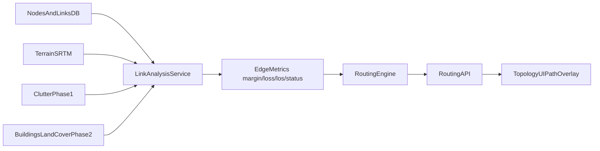

# RF Propagation and Topology Routing Plan

## Scope Decisions Locked
- Routing objective: **multi-objective** (user-selectable metrics in API/UI)
- Obstacle strategy: **hybrid roadmap** (ship phase 1 quickly, design phase 2 with external data)

## Current State (from audit)
- Link-analysis bug root cause was in [`backend/api/links.py`](c:/Users/Joseph/lora-rf-simulator/backend/api/links.py) and RF metrics now flow through `compute_path_loss`.
- Obstacles currently affect **coverage** through empirical clutter in [`backend/services/clutter.py`](c:/Users/Joseph/lora-rf-simulator/backend/services/clutter.py) and [`backend/services/coverage.py`](c:/Users/Joseph/lora-rf-simulator/backend/services/coverage.py), but point-to-point link analysis does not use that same clutter model.
- Topology supports per-link analysis/visualization only; no multi-hop path engine yet in [`backend/api/links.py`](c:/Users/Joseph/lora-rf-simulator/backend/api/links.py) and [`frontend/src/components/SidePanel.vue`](c:/Users/Joseph/lora-rf-simulator/frontend/src/components/SidePanel.vue).
- Project has no automated test harness/CI in [`backend/requirements.txt`](c:/Users/Joseph/lora-rf-simulator/backend/requirements.txt) and [`frontend/package.json`](c:/Users/Joseph/lora-rf-simulator/frontend/package.json).

## Architecture Direction

## Phase 1 — Stabilize and Align RF Behavior (fast, high impact)
1. **Unify obstacle assumptions across analysis modes**
   - Extend point-to-point/link analysis path in [`backend/services/propagation.py`](c:/Users/Joseph/lora-rf-simulator/backend/services/propagation.py) and [`backend/api/links.py`](c:/Users/Joseph/lora-rf-simulator/backend/api/links.py) to optionally apply clutter loss using the same profile inputs used by coverage.
   - Ensure link-level results and coverage-map assumptions are consistent when the same clutter profile is selected.
2. **Fix misleading/unused RF params**
   - In [`backend/services/coverage.py`](c:/Users/Joseph/lora-rf-simulator/backend/services/coverage.py), either wire through or remove unused inputs (`rain_rate_mmh`, `num_profile_points`) and update docstrings to match runtime behavior.
   - In [`backend/services/propagation.py`](c:/Users/Joseph/lora-rf-simulator/backend/services/propagation.py), make `compute_path_loss(model=...)` either functional (real branching) or explicit/deprecated.
3. **Input validation hardening**
   - Add strict enums/ranges in [`backend/api/simulate.py`](c:/Users/Joseph/lora-rf-simulator/backend/api/simulate.py) for `model`, `clutter_profile`, ITM parameters to avoid silent fallbacks and invalid requests.
4. **Quality/safety checks**
   - Add lightweight warnings/flags when terrain data fallback occurs in [`backend/services/terrain.py`](c:/Users/Joseph/lora-rf-simulator/backend/services/terrain.py) so users can detect low-confidence RF outputs.

## Phase 2 — Multi-objective Topology Pathfinding (A→B via relays)
1. **Backend routing engine**
   - Add a routing service (new module recommended: `backend/services/routing.py`) that builds an undirected graph from `network_links` with weights from analyzed edge metrics.
   - Implement selectable objectives:
     - `hops` (BFS)
     - `lowest_total_loss` (Dijkstra)
     - `best_bottleneck_margin` (widest-path/maximin)
   - Support constraints: ignore blocked/unknown edges by default, optional max hops, optional relay role filtering from [`backend/models/node.py`](c:/Users/Joseph/lora-rf-simulator/backend/models/node.py).
2. **Routing API**
   - Add endpoint (recommended in [`backend/api/links.py`](c:/Users/Joseph/lora-rf-simulator/backend/api/links.py) or new router) for path solve with request: `source_id`, `dest_id`, `objective`, optional constraints.
   - Return ordered nodes/links + aggregate metrics + bottleneck edge + unreachable reason.
3. **Frontend integration**
   - Add API client in [`frontend/src/utils/api.ts`](c:/Users/Joseph/lora-rf-simulator/frontend/src/utils/api.ts), types in [`frontend/src/types.ts`](c:/Users/Joseph/lora-rf-simulator/frontend/src/types.ts), state in [`frontend/src/store.ts`](c:/Users/Joseph/lora-rf-simulator/frontend/src/store.ts).
   - Add routing controls/results in [`frontend/src/components/SidePanel.vue`](c:/Users/Joseph/lora-rf-simulator/frontend/src/components/SidePanel.vue).
   - Add highlighted path rendering in [`frontend/src/components/MapView.vue`](c:/Users/Joseph/lora-rf-simulator/frontend/src/components/MapView.vue).

## Phase 3 — Verification and “Fully Working” Baseline
1. **Backend test harness + critical tests**
   - Add pytest stack and API tests for `/api/links/analyze`, routing endpoint(s), and `/api/simulate/*` happy/invalid paths.
   - Add RF regression tests for path loss monotonicity, blocked-link classification, and clutter effect deltas.
2. **Frontend confidence checks**
   - Add at least one smoke test for routing UX state transitions (objective switch, no-path, highlight rendering).
3. **CI gate**
   - Add CI workflow to run backend tests + frontend type/build checks before merge.

## Phase 4 — Obstacle Model Upgrade (Design now, implement next)
- Keep phase 1 empirical clutter as shipping baseline.
- Design phase 2 ingestion for building/land-cover sources (OSM + raster pipeline), then apply to both coverage and path-link analysis for parity.
- Define performance budget before implementation (tile cache strategy, precomputation, timeouts).

## Success Criteria
- Link analysis and coverage use consistent obstacle assumptions when configured.
- Routing endpoint returns deterministic multi-hop paths for all three objectives.
- UI can compute and visualize A→B path via intermediate nodes with objective selection.
- Regression suite catches RF and topology path breaks automatically.
